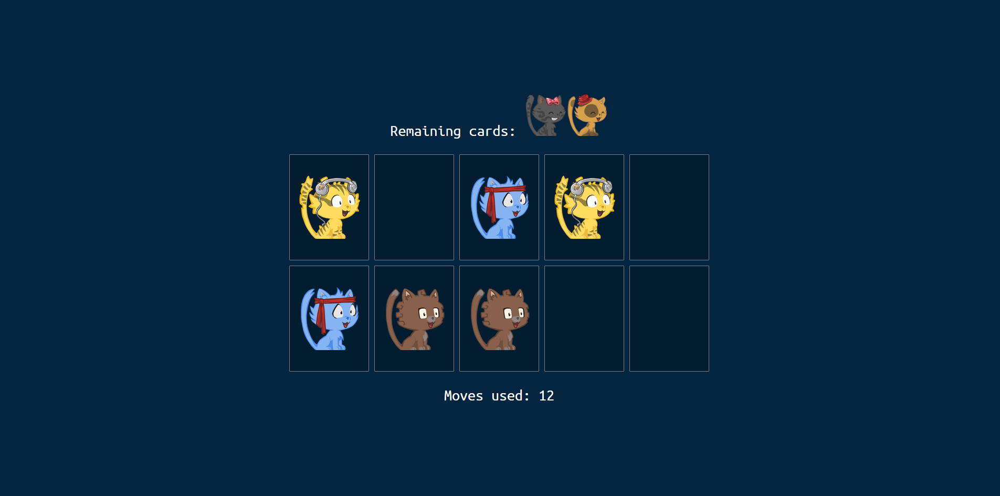

# React Memory Game Tutorial

🚀 Dive into the world of React with my latest tutorial! In this session, I guide you through the process of building a captivating Memory Game using React. Learn how to manage state, handle user interactions with `onClick` events, implement engaging CSS for a 3D card flip effect, and fetch cat images from an API to create two versions of cards. Whether you're a React beginner or looking to enhance your skills, this tutorial offers a hands-on experience to elevate your understanding of state management, event handling, and creative styling. Join me in creating a fun and interactive Memory Game that combines programming prowess with aesthetic appeal!

📺 **[Watch the Tutorial on YouTube](https://youtu.be/4MZR-uGTlAI)**

## Project Overview

This repository serves as a backup for the code developed in the tutorial. Feel free to explore, fork, and use the code to enhance your React skills and create your own exciting projects.

## Getting Started

1. Clone this repository.
2. Navigate to project folder.
3. Run `yarn` or `npm install` to install dependencies.
4. Run `yarn dev` or `npm run dev` to preview the finished project.
